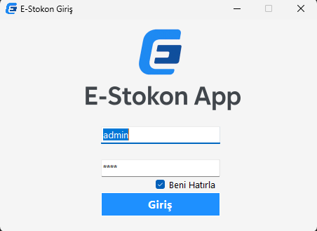
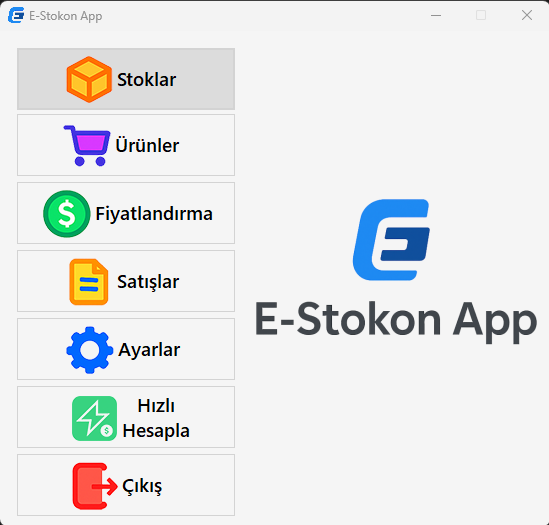
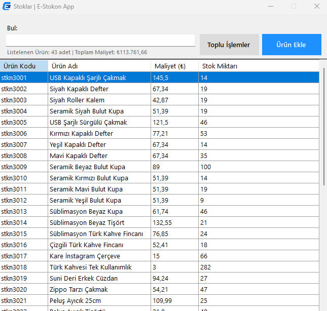
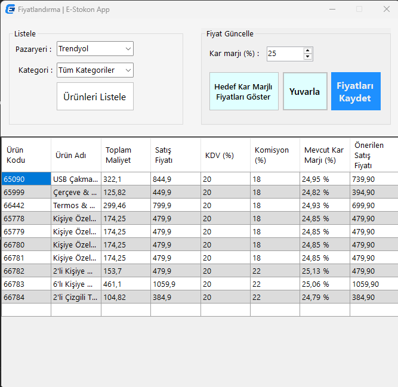

# estokon-inventory
Inventory &amp; Stock Management System developed as a graduation project using C# Windows Forms and Microsoft Access.

# E-Stokon App

📦 **E-Stokon App**, C# Windows Forms ve Microsoft Access kullanılarak geliştirilmiş bir **stok ve ürün yönetim sistemi**dir.  
Bu uygulama mezuniyet projesi kapsamında geliştirilmiştir.

---

## 🚀 Özellikler / Features
- Ürün ekleme, güncelleme ve silme / Add, update, and delete products
- Kategorilerle ürün yönetimi / Product management with categories
- Fiyatlandırma ve kâr marjı hesaplama / Pricing and profit margin calculation
- Satış ekranı ile stok azaltma / Stock reduction via sales screen
- Kombin (ürün grubu) yönetimi / Combo (product group) management
- Microsoft Access (.accdb) veritabanı desteği / Microsoft Access database support

---

## 🛠️ Teknolojiler / Technologies
- **C# Windows Forms**
- **Microsoft Access (OleDb)**
- .NET Framework 4.x

---

## 📷 Ekran Görüntüleri / Screenshots





---

## 🔧 Kurulum / Installation
1. Bu repoyu klonla / Clone this repository:
   ```bash
   git clone https://github.com/yigityasar/estokon-inventory


## 📜 Lisans / License
Bu proje **CC BY-NC 4.0** lisansı altındadır.  
Ticari kullanım yasaktır / Commercial use is prohibited.  
Ayrıntılı bilgi için [LICENSE](./LICENSE) dosyasına bakın / See [LICENSE](./LICENSE) for details.

